# Video-Conference-App

This project is a portfolio showcase demonstrating my skills in mobile app development using the Flutter framework and Dart. It incorporates modern state management with ZEGO CLoud API for seamless video calling and screen sharing with chatting and Firebase integration for authentication, database, and storage.

## Download APK

[Download the latest release APK](https://drive.google.com/drive/folders/1TL6eFN9yY9MuoKBhHQD0Sxp2fAQLxlT4?usp=sharing)

## Project Highlights:

- **User Authentication**: 
  - Integration of Firebase Authentication enabling login via email and Google accounts.

- **Create & Share Meeting Code**: 
  - Users can create and share the meeting code to others via any platform. 
  
- **Easy Join To Meeting**: 
  -  Users can easily added to the meeting by just entering the given meeting code.
  
- **Chats**: 
  - Users can chat and send messages to each other in between the meeting.

- **Screen Sharing**: 
  - Screen sharing fucntionality is also available.

## Tech Stack

- **Flutter (Dart)**: For building the UI and handling the app's core functionality.
- **Riverpod**: For efficient state management.
- **Firebase**: For authentication, database, and storage.
- **ZEGO Cloud API**: Used for real-time Video Conferencing, Chatting and Screen Sharing.

## Screenshots

  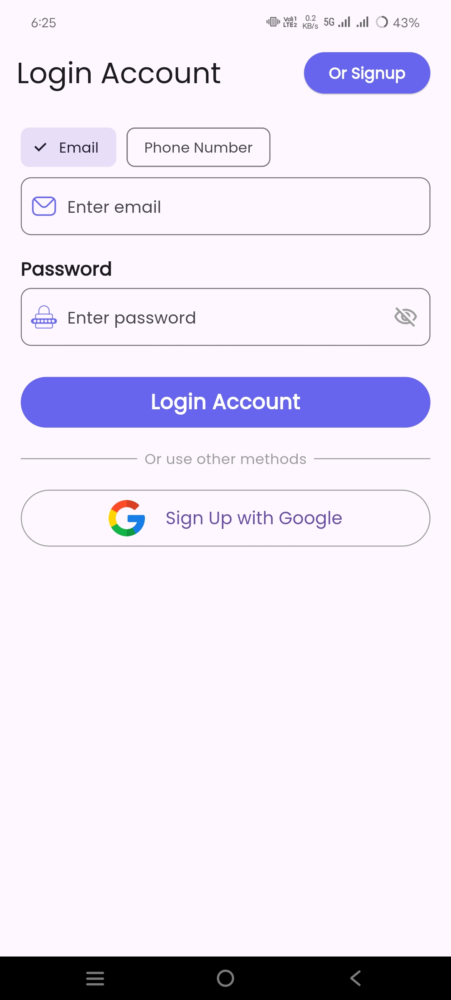
  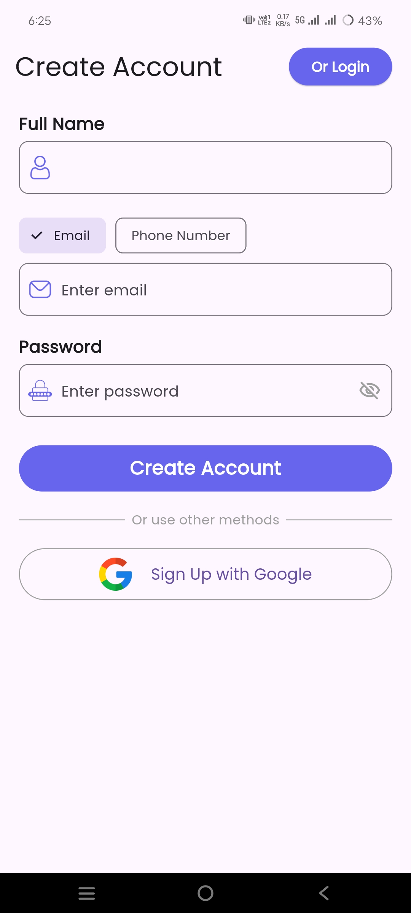
  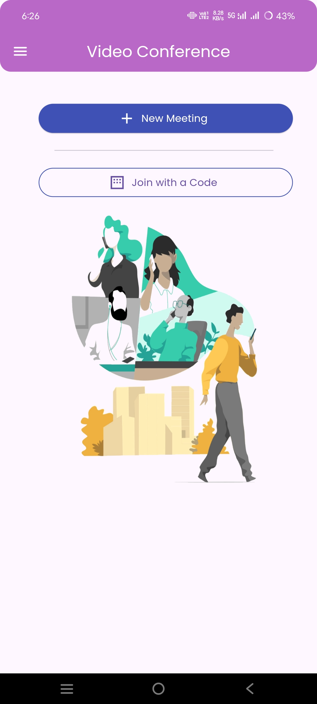
  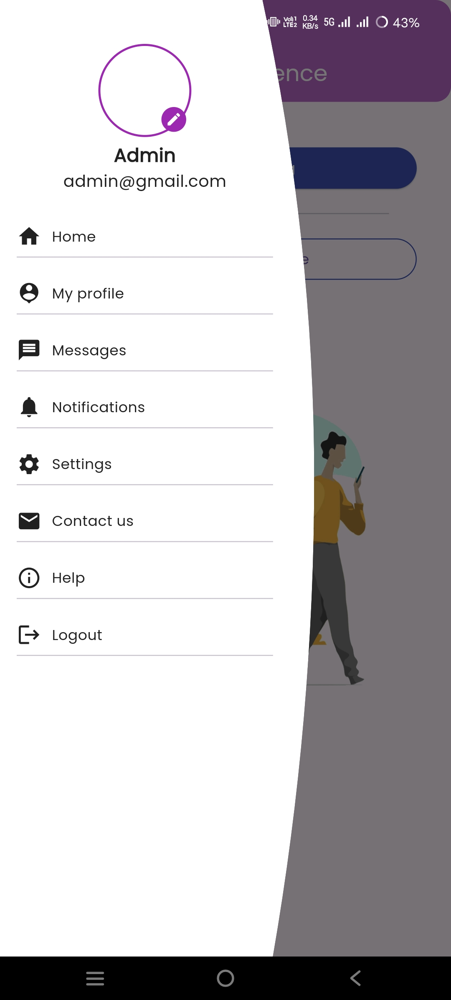
  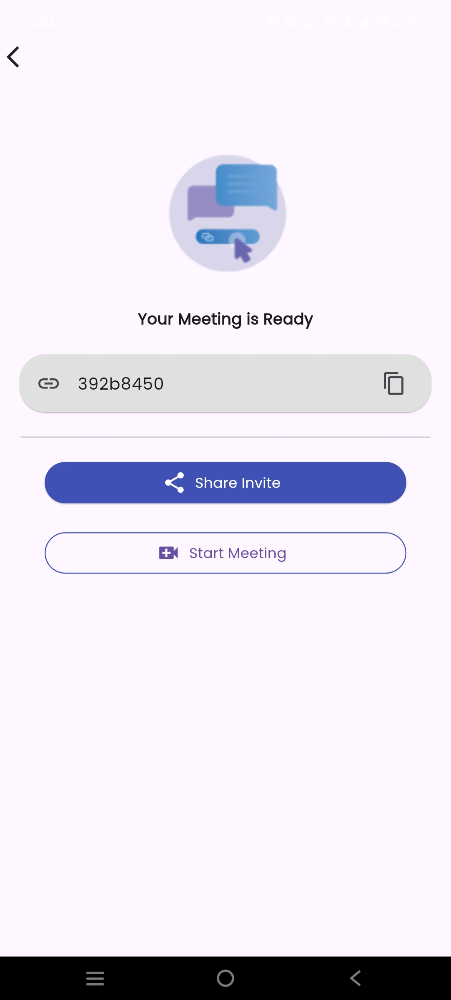
  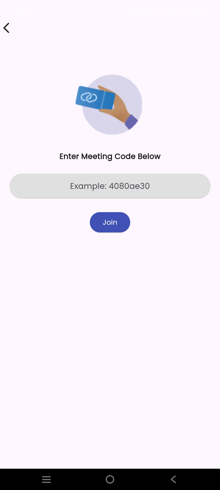
  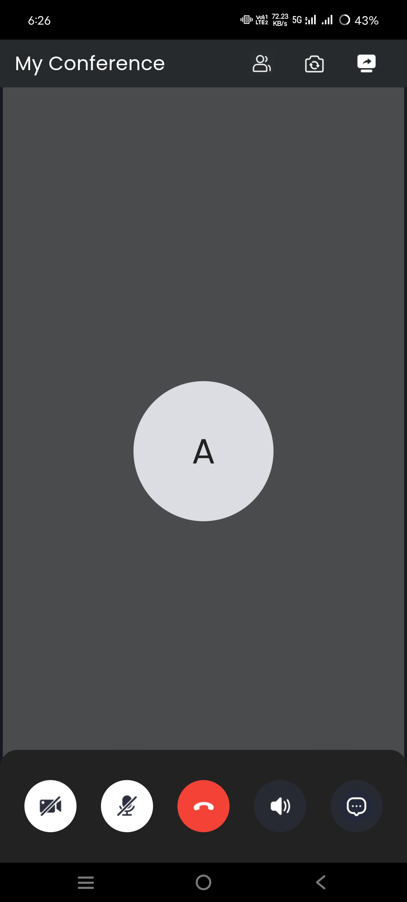
  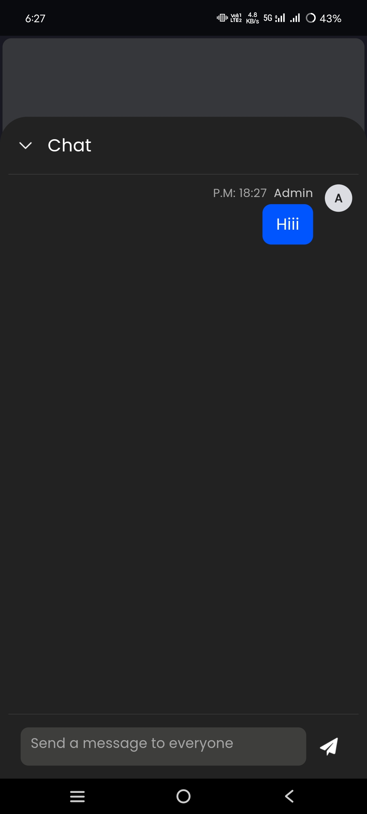
  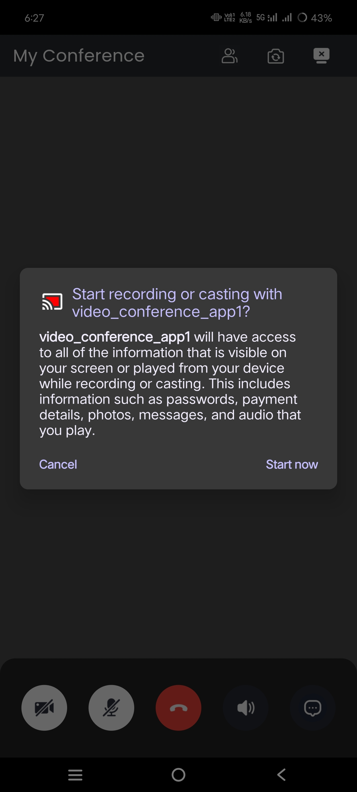
  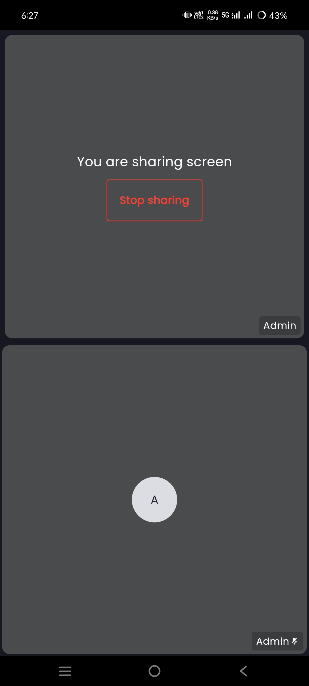
  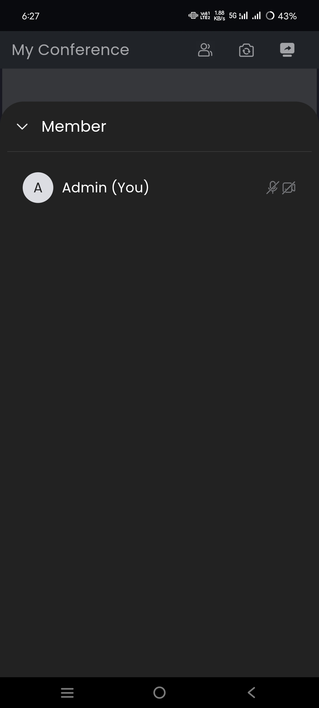
  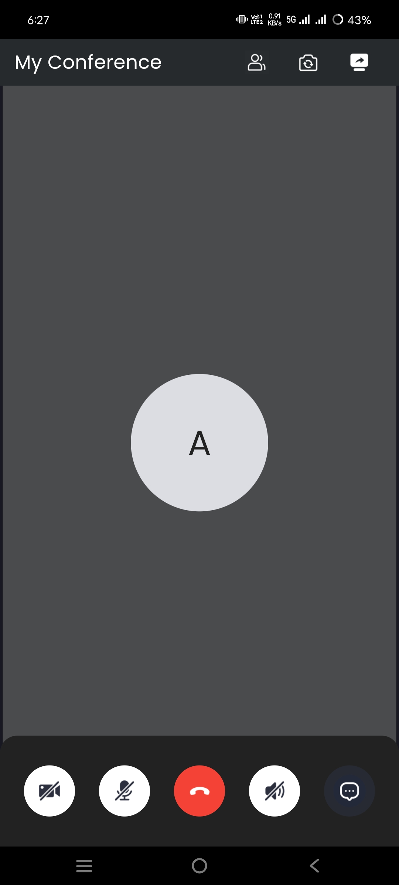
  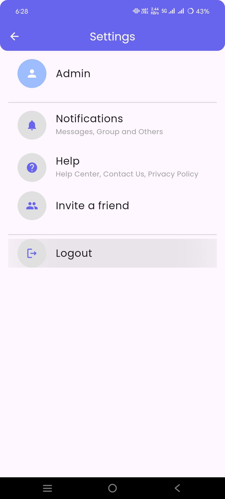

